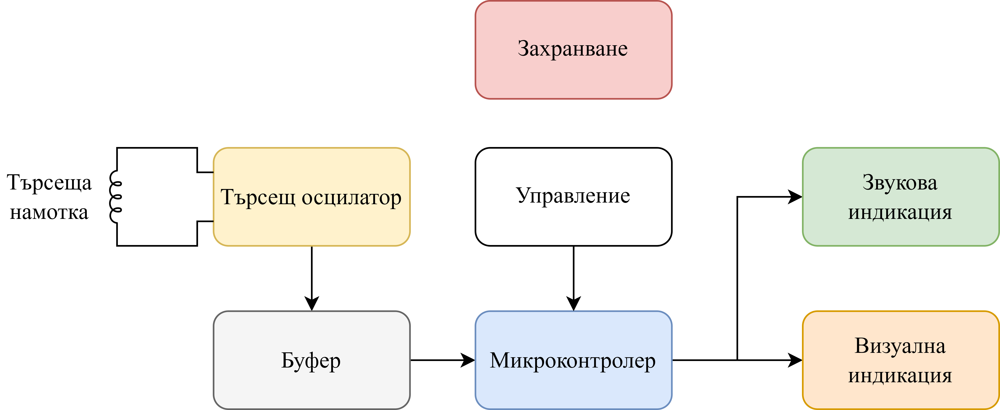
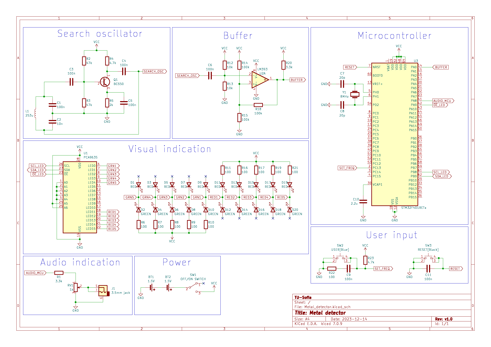
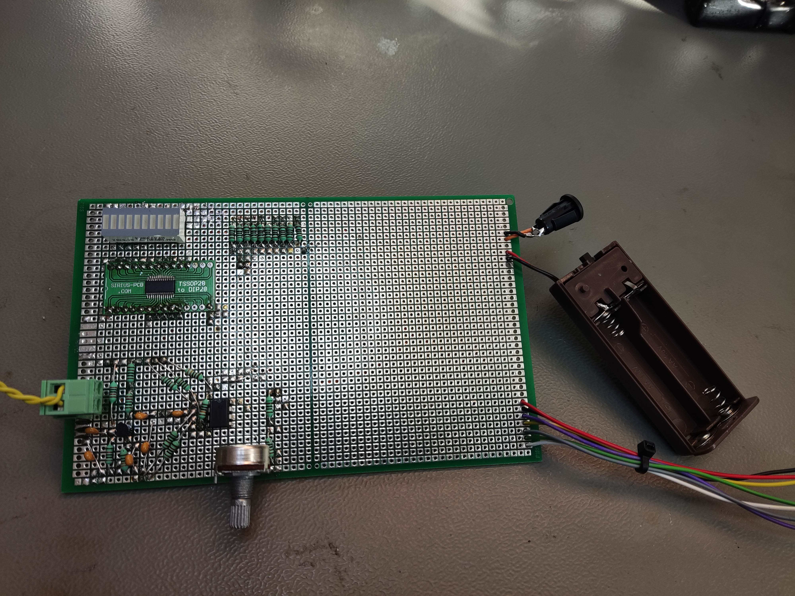
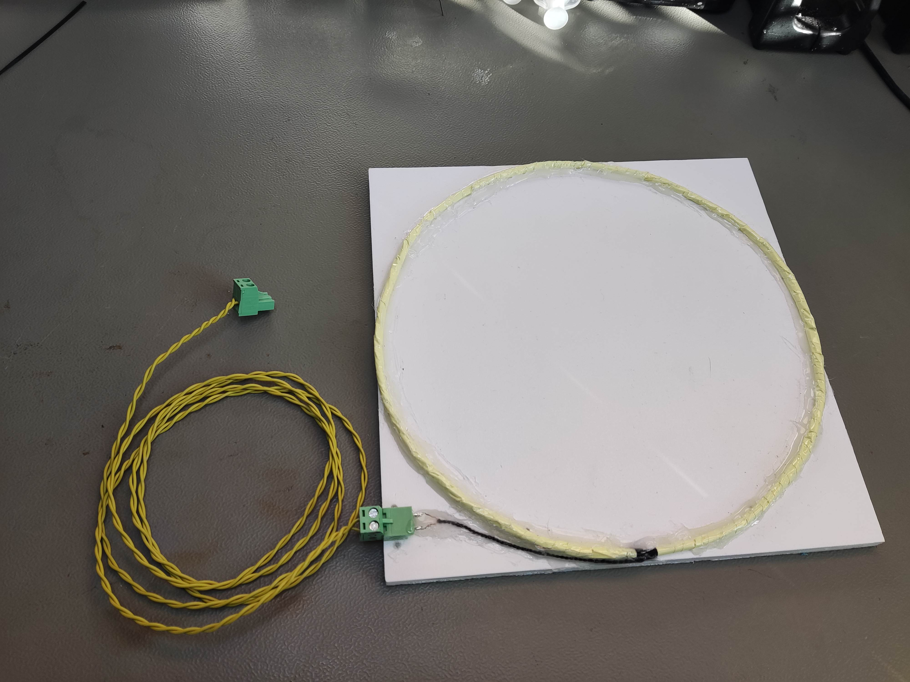
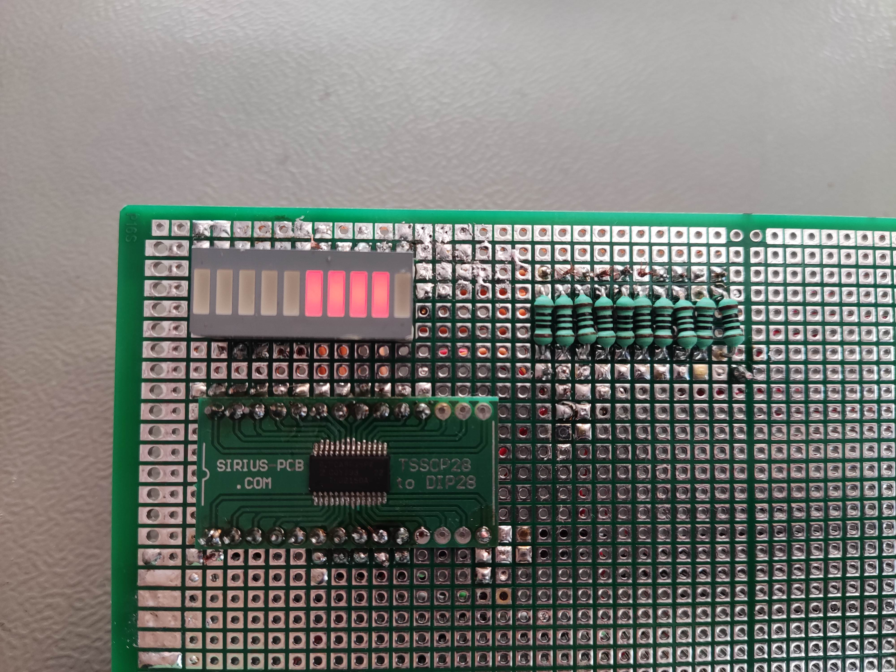
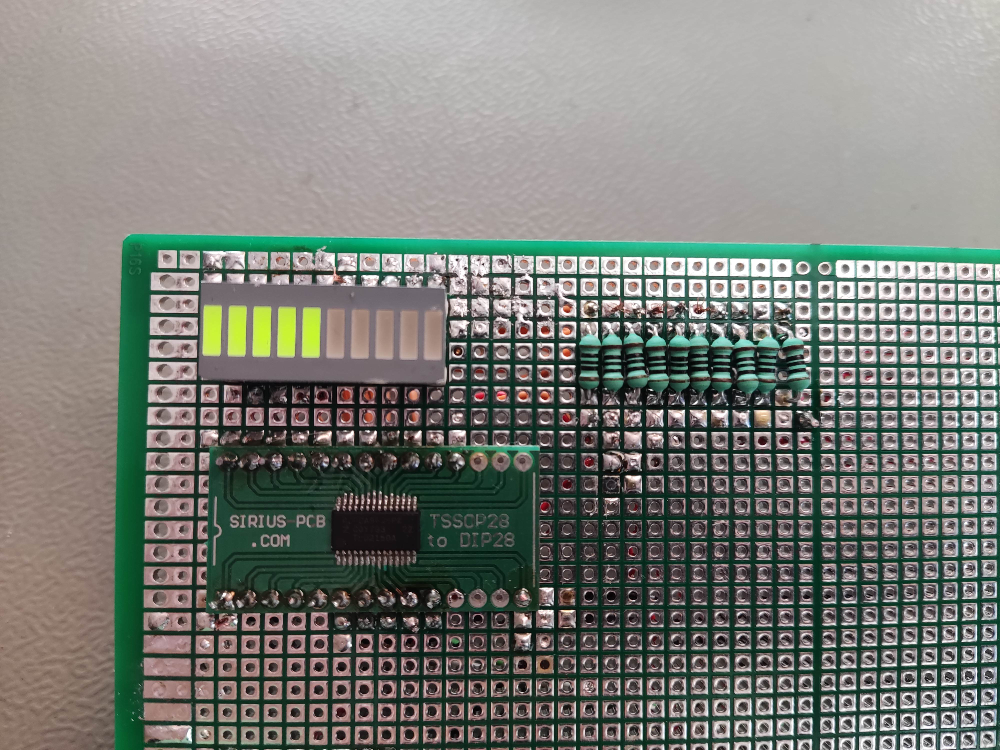

# Металотърсач с биене на честоти  BFO (Beat Frequency Oscillator) metal detector

## [Документация](./Documentation/KR_EUIU_Iliyan_Antov_101220020.pdf)

## Блокова схема:

## Принципна електрическа схема:

## Реализиран прототип:

  
  
  
  

## Използвани технологии:
* Firmware: C/C++
* MCU platform: STM32
* Schematics/Layout: KiCAD

## Автор:
Илиян Антов - [Iliyan Antov](https://github.com/IliyanAntov) - [i.antov2@gmail.com](i.antov2@gmail.com)